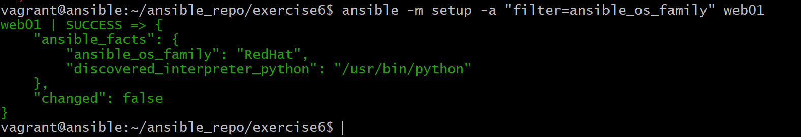
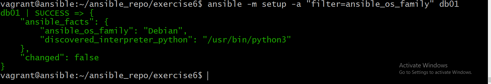

#ANSIBLE

- create a four vms, ansible, srv01, srv02, srv03 using vagrant and install ansible on the ansible vm.
# To install ansible, run the following commands
`sudo apt update`
`sudo apt-add-repository ppa:ansible/ansible`

`sudo apt update`
`sudo apt install ansible`

- to check the version of ubuntu running, run

`lsb_release -a`

- We have to create a user on other three vms. Vagrant ssh into srv01 and create a user named devops and grant the user the sudo privileges

`useradd devops`

`passwd devops`

`visudo`

- We need to check the /etc/ssh/sshd_config file to check the password authentication,let the passwordauthentication be yes

`vi /etc/ssh/sshd_config`

- After the change, you need to restart the service

`service sshd restart`

- Then do the same process for other servers too i.e srv02,srv03

- for srv02(srv01,srv02 which is redhat,run useradd to add a user, and the service name is sshd, that is why we run service sshd restart)

- for srv03, which is an ubuntu, the service name is ssh instead of sshd in Redhat 

`adduser devops`

`passwd devops`

`export EDITOR=vim`

`visudo`

-edit the configuration file /etc/ssh/sshdconfig and passwordaunthentication should be yes

`service ssh restart`

- Now , let us login back to the ansible machine and try to ssh into the linux machines created(srv01,srv02.srv03)

`vagrant ssh ansible`

`ssh devops@192.168.5.3`

 - for srv02

 `ssh devops@192.168.5.4`

 - for srv03

 `ssh devops@192.168.5.5`

  

 - Create your project directory on ansibe manchine,in the home direcory and cd into it

 `mkdir ansible_repo`

 `cd ansible_repo`
 - In this directory, we keep our ansible data, create a new directory here and name it exercise1

 `mkdir exercise1`
 - cd into it and create an inventory file there using vim or any editor of your choice

 `vim inventory-qa`

 

 - Test the connectivity using this command

 `ansible -i inventory-qa  -m ping web01`

 

 - You will notice that first time you want to ssh, there is always a prompt that ask you if you will like to save the fingerprint.This is stored in ~/.ssh/known_hosts

` cat ~/.ssh/known_hosts`

- we can tell ansible to ignore the checking by updating the file ansible.cfg

`sudo vi /etc/ansible/ansible.cfg`

- Test the connectivity with the web02 as well

- Let us try to update our inventory file,by creating groups and group of groups

- check the group connectivity by running

`ansible -i inventory-qa -m ping websrvgrp`

- IF we try to connect to db01 in some older version of ansible, it will fail because ansible uses python 2 and our database manchine is ubuntu 16, which has python 3 by default.In this case, you will instruct ansible to use python 3 in the inventory file BUt I am using latest version here,so it works

- Now enter the /etc/hosts and input the public IP address

- Then go and delete the IP address in inventory-qa file

- Create another directory and name it exercise2,then copy the inventory-qa into it, then generate ssh key using this command

`ssh-keygen`

- Then run this command to copy the ssh key to web01,web02,web03

`ssh-copy-id devops@192.168.5.3`

- Since we have been able to copy the ssh key into the three vms succesfuly, it wont ask us for password again when we try to ssh into any of these vms, so we can remove our password from inventory-qa because of security issues

`ssh devops@192.168.5.4`

`ansible-doc -l` will list all ansible modules which is a lot

- run this command in the exercise2 folder to install httpd

`ansible -i inventory-qa -m yum -a "name=httpd state=installed` web01 --become

- when you run this command again, it will tell you success

- Now that httpd hs been installed on web01,it is time to start the service by running

`ansible -i inventory-qa -m service -a "name=httpd state=started enabled=yes"`

- if you run the command again, it will give you this output(idempotent behaviour)

## creating your own ansible configuration
- copy all the content in exercise2 to exercise3, then use vim to create a file named ansible.cfg

`vim ansible.cfg`

- then run adhoc command
`ansible -m ping web01`

## Creating ansible playbooks

- Ansible playbooks returns yaml format,yaml is not a programming language,it is a data representation language

- cp the content of exercise 3 to exercise4
`cp -r exercise3 exercise4`

- run this command

`ansible -m ping all`

- In exercise4 directory,create your playbookfile,you can name it anyname,I will name it webdeploy.yml

`vim webdeploy.yml`

- now try and execute the playbook using this command

`ansible-playbook webdeploy.yml`

### Writing ansible playbook part2

- copy the content of exercise4 to exercise5
- copy the content of webdeploy.yml into web_db_deploy.yml, and update the playbook

### Ansible setup modules and register

run this command
`ansible  -m setup web01`

- you can also filter out specific information

`ansible -m setup -a "filter=ansible_os_family" web01`

## Setup modukes and variables
- update your playbook as shown below

- then run this commmand

`ansible-playbook setup_print.yml`

## Variables on ansible
