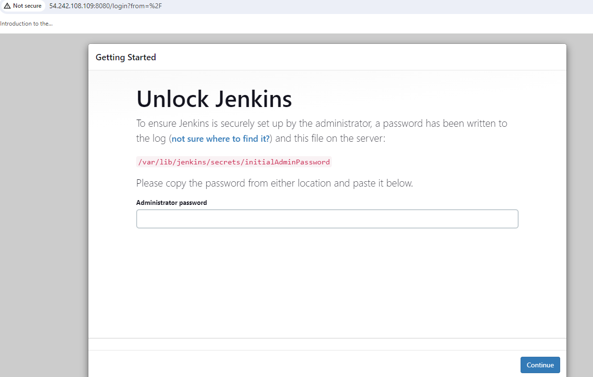

### End to End Project: Deployed Django Application with Jenkins CI/CD Pipeline

- Step 1, install docker and Jenkins on your Linux server (ubuntu 20.04)

- Commands to install Docker;

`sudo apt-get update
sudo apt install docker.io
`

- Commands to install Jenkins in sequence ( Run one after the other)

`sudo apt-get update

sudo apt-get install openjdk-11-jdk
`
 

- Now, install the dependencies ( Just copy this code altogether and paste in your console)

`curl -fsSL https://pkg.jenkins.io/debian-stable/jenkins.io.key | sudo tee \  
/usr/share/keyrings/jenkins-keyring.asc > /dev/null

echo deb [signed-by=/usr/share/keyrings/jenkins-keyring.asc] \
  https://pkg.jenkins.io/debian-stable binary/ | sudo tee \
  /etc/apt/sources.list.d/jenkins.list > /dev/null

sudo apt-get update

sudo apt-get install jenkins`

- Start Jenkins and check the Status

 

 - Step 2, Basic setup of Jenkins
 - Now open your browser and enter http:<ipaddress>>:8080

Still, you can't access Jenkins on port 8080, as our server didn't allow incoming traffic on port 8080

- For the administrator password; enter the following command

`sudo cat /var/jenkins_home/secrets/initialAdminPassword`

- Now, you are at the Dashboard of Jenkins; it might look like this
 

 - Step 3, Set up an agent for pipelines in Jenkins
 - On Jenkins Dashboard, click on set up an agent to create a node; A node creates a separate environment for your pipeline.

- Enter node name; select permanent agent and create
- Now, the Configuration panel would open; Enter the details name, and description (optional) and then select web socket. Leave everything as default.

- In the settings; select webhooks; at the payload URL enter http://<ip-of-your-server>:8080//github-webhook/ . Here, port 8080 will link this repo to our Jenkins. Copy this secret Personal Access Token.

- Now, we will use this Personal Access Token during the configuration of the CI/CD pipeline.

- Step 5, Configuration of CI/CD pipeline
-Click on create a job, to create and configure your pipeline.
- Now, the configuration panel for your job (CI/CD pipeline) would open
- Here, you can add a Description about the pipeline

- As we are accessing our code from GitHub directly; select git in Source Code Management; add URL of the repository

- Leave domain as default; in kind select secret text from the dropdown menu leave the scope global and add GitHub Token as secret text and add id (must be unique).

- Add your branch name; if and only if you have another branch else leave it as default.
-  In build steps; select execute shell. Here, these commands will create a docker image from dockerfile(already in the code) and then run this dockerized code on port number 8001. Afterward click on the save button.

- Step 6, Build Pipeline
- After the configuration is saved click on Build Now, to build the pipeline