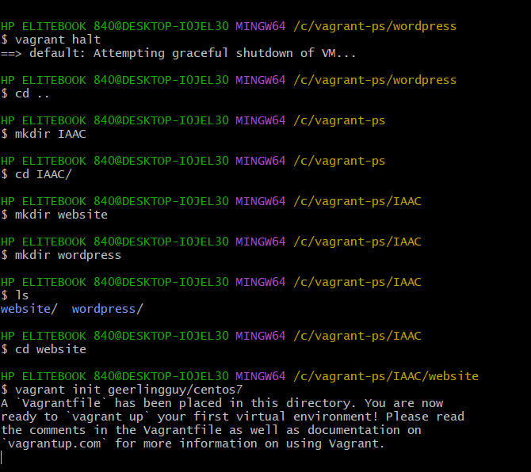
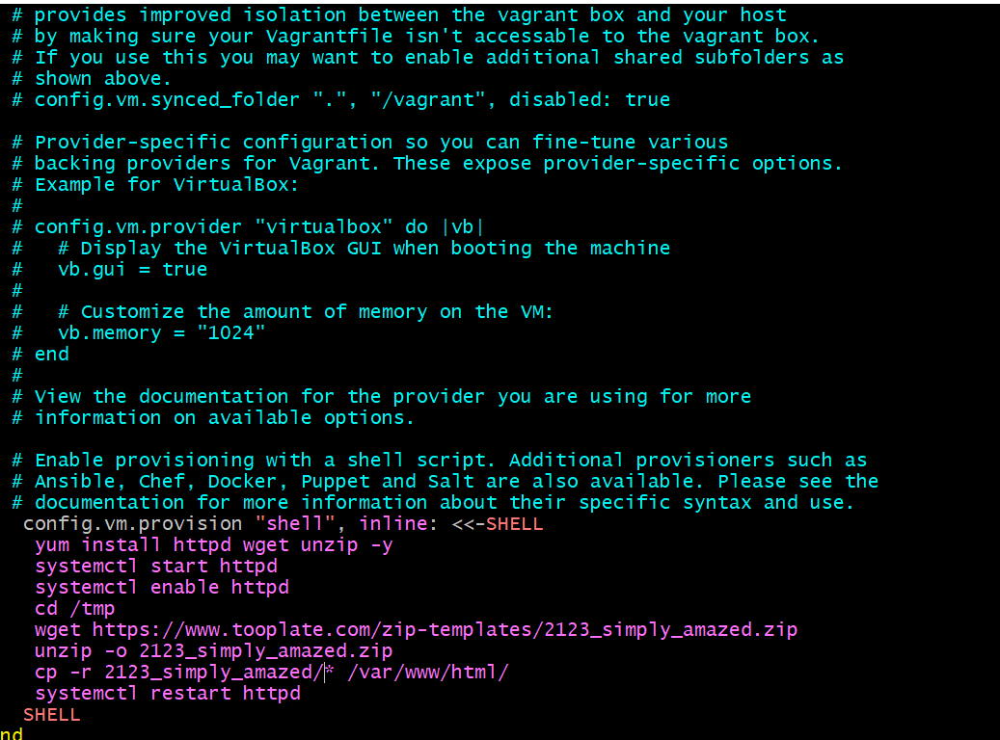
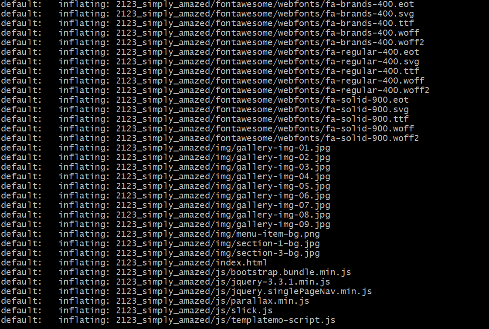
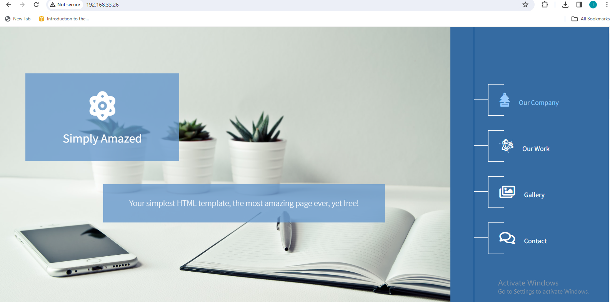
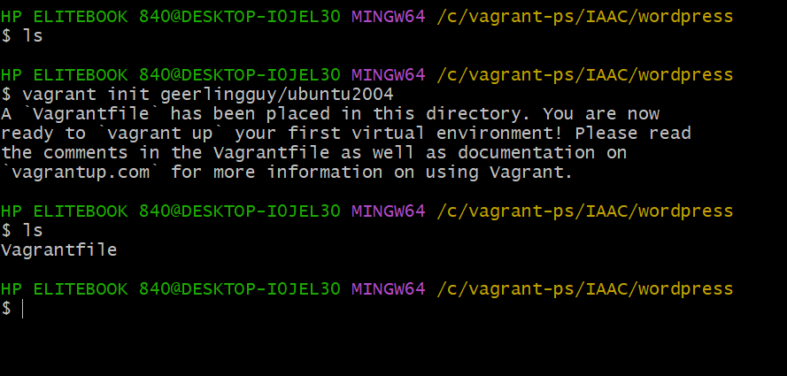

#### Infrastructure as a code

- Create a directory named IAAC, it can be any name
`mkdir IAAC`
- cd into the directory and create a website and wordpress directories.
`mkdir website`

`mkdir wordpress`

- cd into website
`cd website`
- run this command
`vagrant init geerlingguy/centos7`

- open the vagrantfile with vi or any other editor and insert your commands

- run vagrant up 

- Finally, check the ip address on your web browser, you should see something like this:

#### wordpress automation using ubuntu 20.04

- cd into wordpress directory
- run this command
`vagrant init geerlingguy/ubuntu2004`

