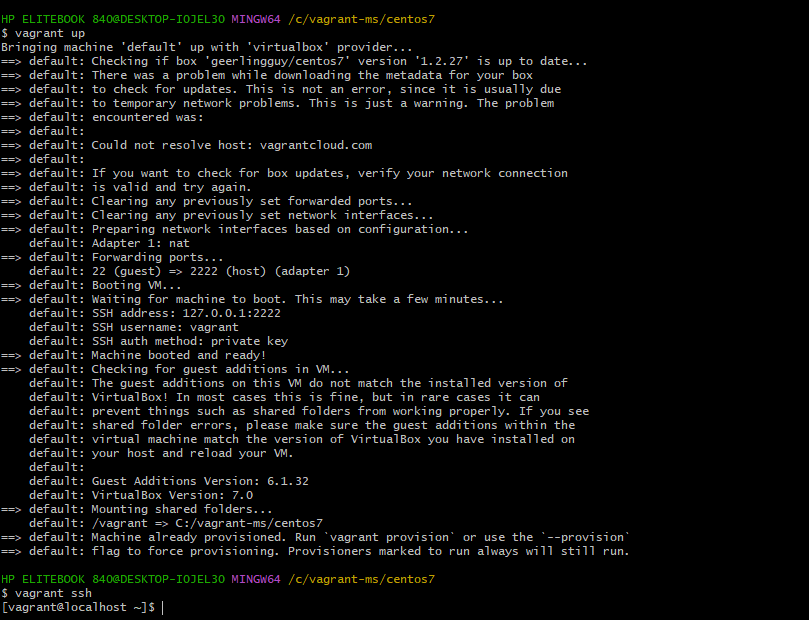
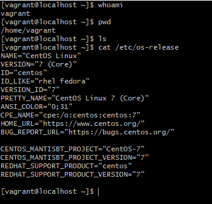
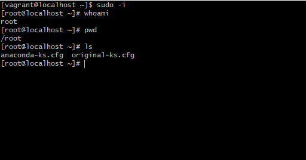

## What to learn in Linux

1. Introduction to Linux
2. Basic CLI Commands
3. Understanding files in Linux
4. Filters & Redirection

5. Users & Group
6. Sudo
7. Software management
8. Services & Processes
9. Good to know commands
10. Server Management

## Introduction to linux
- linux is an open source operating system

- Everything is a file(including hardware)
- Small Single Purpose Programs
- Ability to chain programs together for complex operations
- Avoid Captive User Interface
- Configuration data stored in a text file(so that you can easily make changes to those files)

# Why linux?

- Opensource
- Community Support
- Support Wide Variety of Hardware
- Customization
- Automation
- Most Servers runs on Linux
- Security

## Popular Linux distros
### Popular Desktop Linux OS
- Ubuntu Linux
- Linux Mint
- Fedora
- Arch Linux
- Debian
- OpenSuse

## Popular Linux Sever OS 
- Red Hat Enterprise Linux(most stable and secure OS)
- Ubuntu Server(easiest)
- Centos(similar to RHEL,but it is an opensource while RHEL is not)
- SUSE Enterprise Linux

- RPM BASED: RHEL, Centos, Oracle Linux , Amazon Linux
- Debian based: Ubuntu Server, Kali 

## Some Important Directories
- Home Directories: /root, /home/username
- User Executable: /bin, /usr/bin, /usr/local/bin
- System Executables: /sbin, /usr/sbin, /usr/local/sbin
- other Mountpoints: /media, /mnt
- Configuration: /etc
- Temporary Files: /tmp
- Kernels and Bootloader: /boot
- Server Data : /var, /srv
- System Information: /proc, /sys
- Shared Libraries: /lib, /usr/lib, /usr/local/lib

## Basic Commands of Linux

- Basic linux command

- To switch to root user in agrant, run this command

` sudo -i`

- Basic commands as root

