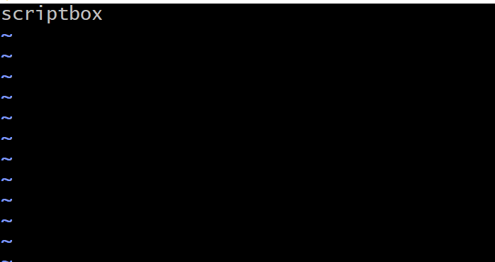
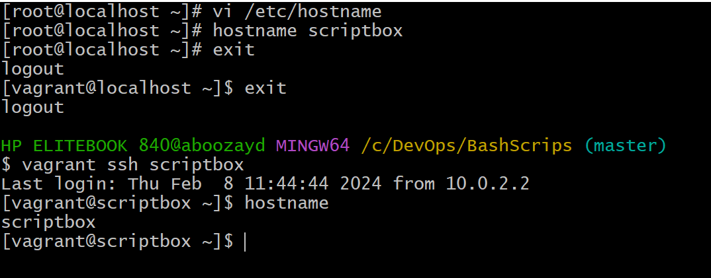
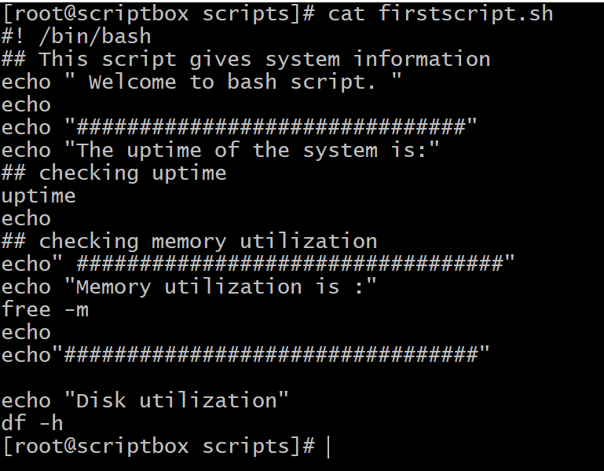

### Bash scripting

## welcome to bash scripting

- we will be using three vitual machines via vagrant for this exercise

- let us edit the hostname using this command and change the content to scriptbox
  `vim /etc/hostname`

- then run this command afterwards
  `hostname scriptbox`

- Then logout and login back and run hostname command
  

## Now let us write our first script

- we are going to write our first script and we will place it in /opt/scripts directory, so make the directory and cd into it

- Then, we will be writing our scripts using vim,so install it using
`yum install vim -y`

- name your file as firstscript.sh and inside the im, the first line should contain shebang which acs as an interpreter for the commands in it

`vim firstscript.sh`
- To run our script, you have to give its relative or absolute path and you must give the file executable permission using this command

`chmod +x filename`

## Section Two
- we are going to write script that will set up some websites for us instead of doing it manually by running commands one by one

- create a new file in the scripts directory and name it websetup.sh

`vim /opt/scripts/websetup.sh`

- the script will be inside the file

`!# /bin/bash
# Installing dependencies
echo "################################"
echo " Installing dependencies "
echo "################################"
sudo yum install wget unzip httpd -y
echo

# start and enable service
echo "###################################"
echo "Start and enable httpd service"
echo "####################################"
sudo systemctl start httpd
sudo systemctl enable httpd
echo

# creating temporary directory
echo"######################################"
echo" Starting Artifact Deployment"
echo"######################################"
mkdir -p /tmp/webfiles
cd /tmp/webfiles
wget https://www.tooplate.com/zip-templates/2098_health.zip
unzip 2098_health.zip
sudo cp -r 2098_health.zip/* /var/www/html
echo

# Bounce srvice
echo"#########################################"
echo"Restarting httpd service"
echo"##########################################"
sudo sysetmctl restart httpd
echo

# cleaning up
echo"##############################################"
echo" Removing temporary files"
echo"###############################################"`

- 