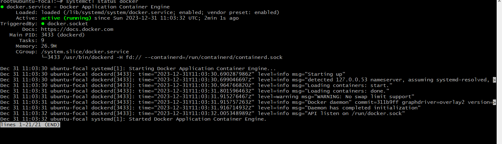
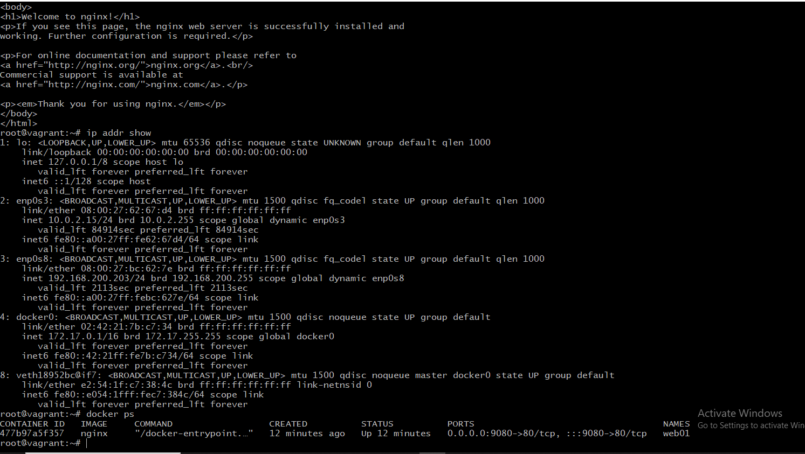

## DOCKER HANDS-ON
- create a directory named containerIntro and cd into it

- place the vagrantfile inside it with commands that install command.then run vagrant up to bring up the docker

- then vagrant ssh into it

- check dockers status
`systemctl status docker`

- create an image hello world
`docker run hello-world`

- docker commands

- to check for port ,run docker ps

