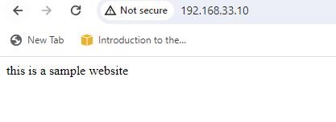

### Sync Directories

### Hosting a website

#### step 1 - go to [tooplate](https://www.tooplate.com/view/2121-wave-cafe) to pick any html page you link

#### navigate to vagrant-ps and create a directory and run vagrant init plus name of the box to have vagrantfile in the directory

- we need  ip address to assess our website, so we edit the vagrantfile in vim editor

- run vagrant up

- run vagrant ssh, then install the packages by running
`yum install wget unzip -y`

- run
`systemctl start httpd`
`systemctl enable httpd`

- to access the default page, you need your ip adrress, either static or public ip address, to get ip address , run this command

`ip addr show`

- if you paste the ip address on any browser, it should show you something like this

- since server data is located in /var directory, hence put your html templates or files in this directory

`cd /var/www/html`

- in this directory, open index.html file with vi editor and type some text in it

- Then restart your server
`systemctl restart httpd`

- To download our wavecafe html template on our machine, cd in to tmp directory and run
`wget https://www.tooplate.com/download/2121_wave_cafe `

- Bevause the downloaded file is in zipped mode, run unzip command to unzip it

- Take a look at what the unzipped file look like

- then copy the files and directories inside the /tmp/21-21_wave_cafe into /var/www/html

`cp -r * /var/www/html`

- Restart your server

`systemctl restart httpd`

- confirm if the file copied successfully to /var/www/html

`ls /var/www/html`

- refresh the apache site and it should look like this

#### VARIABLES

