## Vi
[virtualization](https://www.simplilearn.com/benefits-of-virtualization-in-cloud-article)
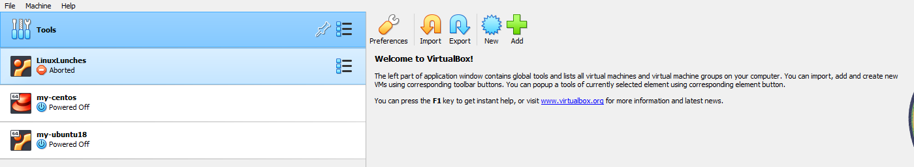
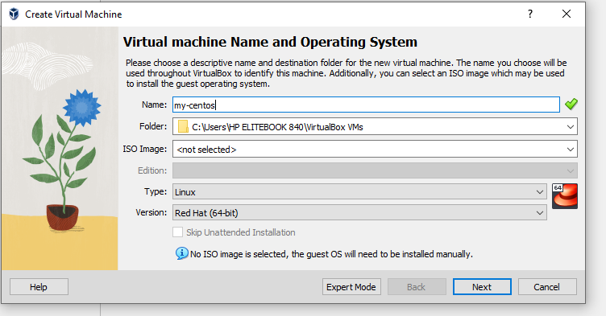

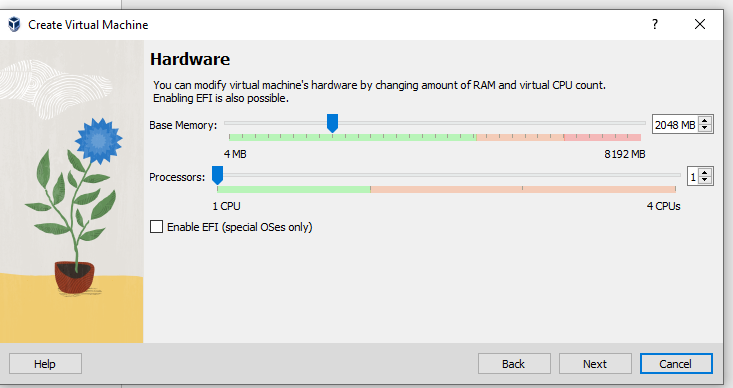

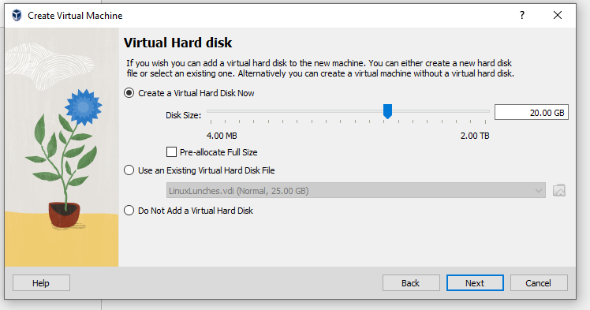

- To download centos7 iso, click on this link [centos7 iso](http://isoredirect.centos.org/centos/7/isos/x86_64/)

- then click on :

- Then, download this:

### To install the centos OS:
- click on settings:
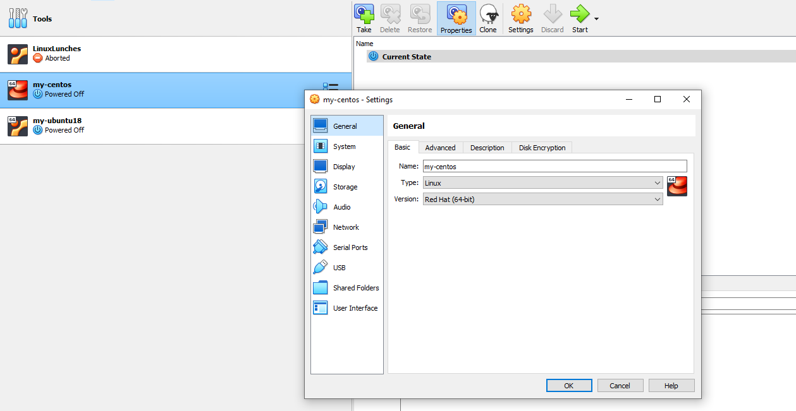

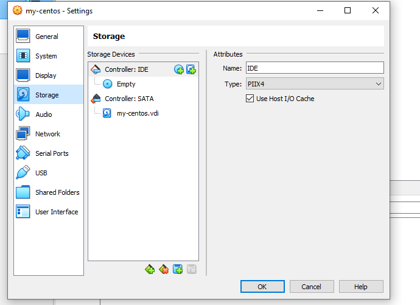

- choose the downloaded centos7 iso:
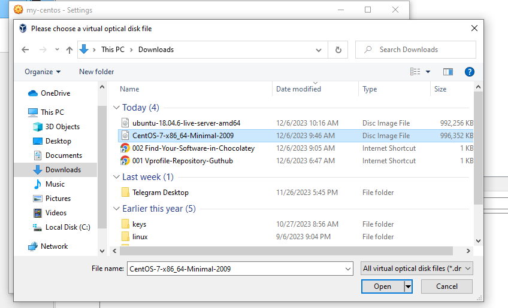

- check the CD/DVD box and click ok:
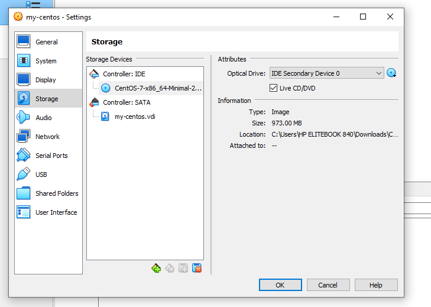

- click on network and attach adapter
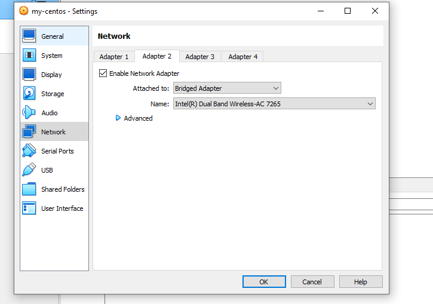

## the same step will be repeated for ubuntu, but it will be ubuntu(64bit) instead of redhat(64bit)

## How to install Vagrant on VM automatically

- create a directory 
`mkdir vagrant-ms`

- cd into the directory

`cd vagrant-ms`

- create a direcory named centos7 or any name

`mkfir centos7`

- create another directory name ubuntu18 or any name of your choice

`mkdir ubuntu18`

- cd into centos7

`cd centos7`

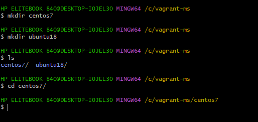

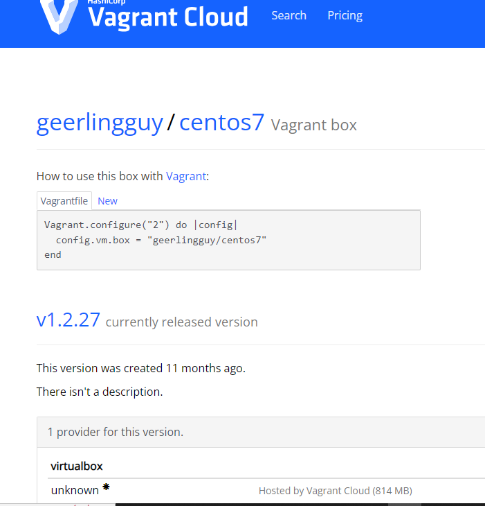

- write this command below
`vagrant init geerlingguy/centos7`

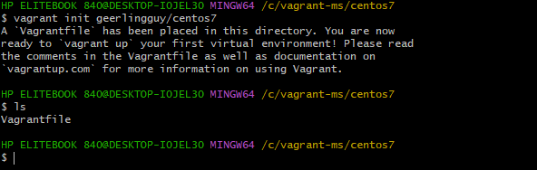

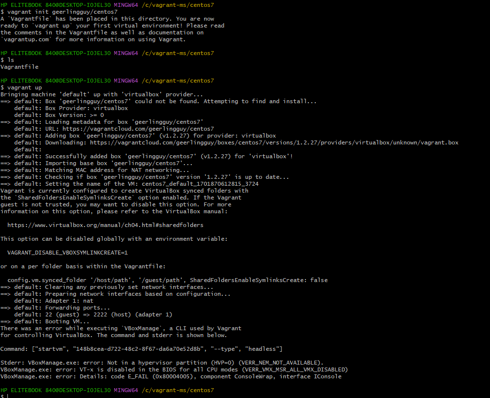

- run vagrant bup to run the vagrant
`vagrant up`

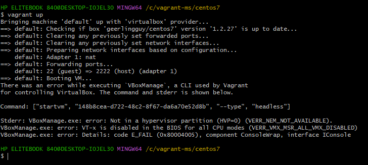

- you can do the command below to login into the vagrant
`whoami`
- To see the working directory run:
`pwd`
- To list out filea in the current directory, you run
`ls`

- To read a file, run cat command
`cat /etc/os-release `

- To switch to root user
`sudo -i`
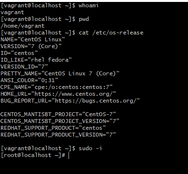

- forward slash (/) means root directory

- To make directory, run
`mkdir nameof dir`

- to make file, run:
`touch nameof file`
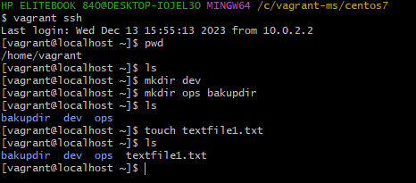

- To copy one directory to another directory, run:
`cp -r`

- To set number in linux run
`:se nu`
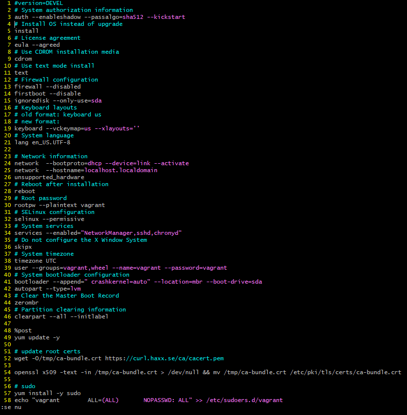

- To navigate to the first line, run
`gg`

- To naviagate to the last line run,
`shift + g`

- To copy in linux run on the line 
`yy`

## FILER AND IO REDIRECTION COMMANDS

- To search for content i files,run
`grep`

- To disable the case sensitivity, run
`grep -i`

- To ensure the grep command get into directory, run
`grep -iR `

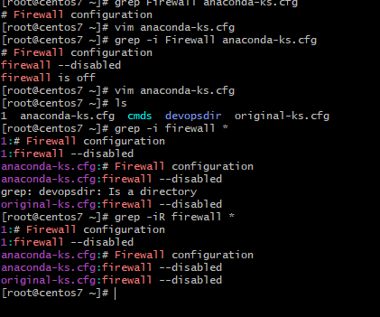

- To avoid searching for a particular word,run
`grep -vi`

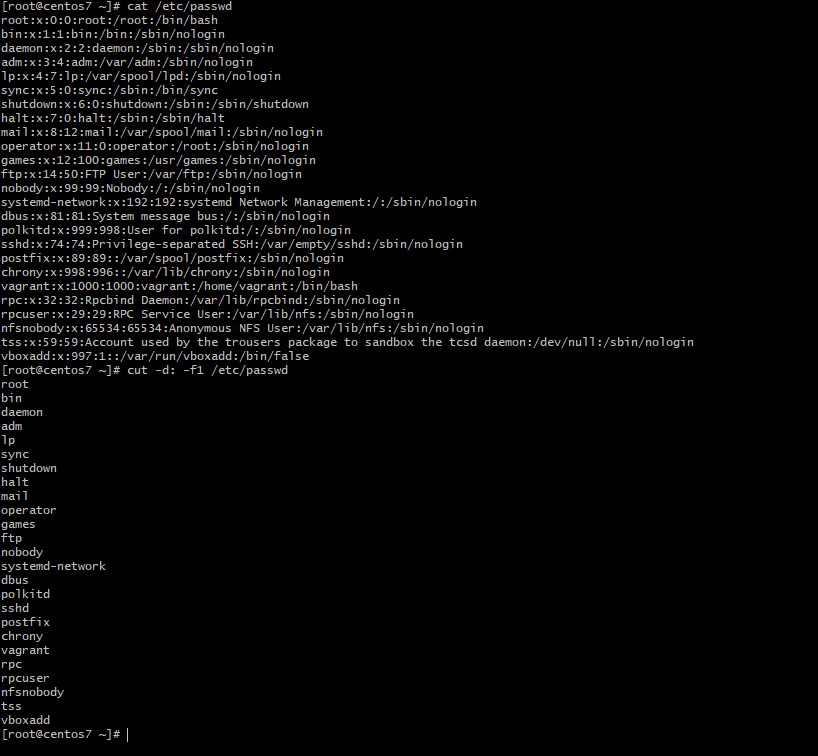

- To paste above run
` P`
- To paste below run
`p`

- If you want to copy multiple lines like 4 lines run:
`4 yy`

- To delete run
`dd`

- To undo ,use
`u`

- to count number of lines run
`wc -l `
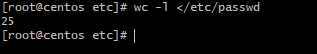

- standard ouput redirection
` ls >> /etc/passwd`
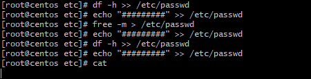

`uptime > /tmp/sysinfo.txt`

- if you dont want to see any output in a file, you can reidret it to dev/null
`yum install vim -y /dev/null`
