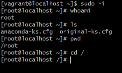
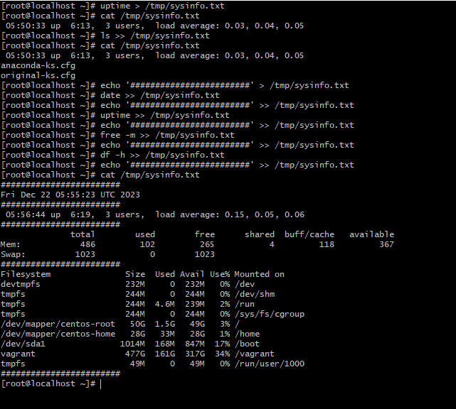

## Vi

[virtualization](https://www.simplilearn.com/benefits-of-virtualization-in-cloud-article)

- To download centos7 iso, click on this link [centos7 iso](http://isoredirect.centos.org/centos/7/isos/x86_64/)

- then click on :
  

- Then, download this:
  

### To install the centos OS:

- click on settings:
  

- choose the downloaded centos7 iso:
  

- check the CD/DVD box and click ok:
  

- click on network and attach adapter
  

## the same step will be repeated for ubuntu, but it will be ubuntu(64bit) instead of redhat(64bit)

## How to install Vagrant on VM automatically

- create a directory
  `mkdir vagrant-ms`

- cd into the directory

`cd vagrant-ms`

- create a direcory named centos7 or any name

`mkfir centos7`

- create another directory name ubuntu18 or any name of your choice

`mkdir ubuntu18`

- cd into centos7

`cd centos7`

- write this command below
  `vagrant init geerlingguy/centos7`

- run vagrant bup to run the vagrant
  `vagrant up`

- you can do the command below to login into the vagrant
  `whoami`
- To see the working directory run:
  `pwd`
- To list out filea in the current directory, you run
  `ls`

- To read a file, run cat command
  `cat /etc/os-release `

- To switch to root user
  `sudo -i`
  

- forward slash (/) means root directory
  

- To make directory, run
  `mkdir nameof dir`

- to make file, run:
  `touch nameof file`
  

- To copy one directory to another directory, run:
  `cp -r`

- To set number in linux run
  `:se nu`
  

- To navigate to the first line, run
  `gg`

- To naviagate to the last line run,
  `shift + g`

- To copy in linux run on the line
  `yy`

## FILER AND IO REDIRECTION COMMANDS

- To search for content i files,run
  `grep`

- To disable the case sensitivity, run
  `grep -i`

- To ensure the grep command get into directory, run
  `grep -iR `

- To avoid searching for a particular word,run
  `grep -vi`

- To paste above run
  ` P`
- To paste below run
  `p`

- If you want to copy multiple lines like 4 lines run:
  `4 yy`

- To delete run
  `dd`

- To undo ,use
  `u`

- to count number of lines run
  `wc -l /etc/paswwd `
  

- to count the no of files in etc, first cd into etc, then run
  `ls | wc-l`
  

- to search for files that start with host in etc, run
  `ls | grep host`
  

- standard ouput redirection
  ` ls >> /etc/passwd`
  

`uptime > /tmp/sysinfo.txt`

- if you dont want to see any output in a file, you can reidret it to dev/null
  `yum install vim -y /dev/null`

- if you want to redirect standard error to a file,add 2
  ` free -m 2 > /tmp/error.log`
  

- go get any type of output, including standard error use '&'
  `freeee -m &>> /tmp/error.log`
  

### PIPING

- to count the no of files in etc, first cd into etc, then run
  `ls | wc-l`
  

- to search for files that start with host in etc, run
  `ls | grep host`
  

- To search if there is vagrant in the laxt 20 files of /var/log/messages, run
  `tail 20 /var/log/messages | grep -i vagrant`
  

## find command

- to find any files, you can use file command
  `find /etc -name host*`

## USERS AND GROUPS

- to add users, run useradd aomand
  `useradd ansible`
  `useradd jenkins`
  `useradd aws`
  

- to create group, run
  `groupadd devops`
  

- to create passwd, run passwd and the name of the group
  

- to switch from rootuser to a regular user run su -name of rhe user
  `su -ansible`
  

- ro delete user, run userdel command
  `userdel -r aws`
  `userdel -r jenkins`
  `userdel -r ansible`

- to remove group run groupdel
  `groupdel devops`
  
  

- to add a user to a particular group run:
  `usermod -aG nsmeofgroup nameofuser`

### FILE PERMISSIONS

- to change ownership ,run chown command:
  -to change the ownership recursively i.e to all subdirectories inside the file,add R
  `chown -R ansible:devops /opt/devopsdir`
  

- to remove executable permission from others,run:
  `chmod o-x`

-to add write permission to group(symbolic), run:
`chmod g+w `

- if you want to change permission numerically:
  `chmod 770 /opt/webdata`
  

### SUDO

- Sudo gives power to normal users to execute commands which is owed by root user
- to set your file to have root privileges cd into
  `cd /etc/sudoers.d`
  

### SOFTWARE MANAGEMENT

- TREE COMMAND

- yum automates all packages it is located in /etc/yum.repos.d

- steps to install jenkins on centos7
`sudo wget -O /etc/yum.repos.d/jenkins.repo \
    https://pkg.jenkins.io/redhat-stable/jenkins.repo`
- the code above will create a file named 'yum.repos.d/jenkins.repo

`sudo rpm --import https://pkg.jenkins.io/redhat-stable/jenkins.io-2023.key`
- helps get key to get access to the repository

`sudo yum upgrade`

``