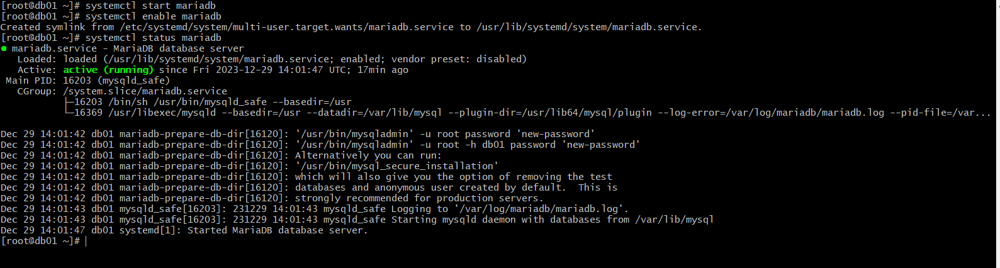

### Multi tier web application stack
### setup on laptop/desktop
### Tools
- Hypervisor -oracle vm virtualbox
- Automation -vagrant
- CLI -gitbash
- IDE - sublime text

#### Architecture of project services
- NGINX
- TOMCAT
- RABBITMQ
- MEMCACHED
-  MYSQL

### Architecture of automated setup
- vagrant
- virtualbox
- gitbash

- Before you bring up the vagrant, you must install all these
-  vagrant plugin install vagrant-hostmanager
- vagrant plugins install vagrant-vbguest

### step 1 - clone the repository

- run vagrant up
`vagrant up`
- ssh into webo1 and confirm connectiviity by running
`ca /etc/hosts`

- then run:
`ping app01`

- all the 5 vms will be running by now
- vagrant ssh into db01, switch to root user and run
`yum update -y`

- run this command
`yum install epel-release -y`

- run this command to make it permanent

`source /etc/profile`

- run:
`yum install git mariadb-server -y`

- Check if mariadb is active

`systemctl status mariadb`

- set up mysql root password

- run thus command and enter the password earlier set
`mysql -u root -p`

- clone into the source repository

` git clone -b local-setup https://github.com/devopshydclub/vprofile-project.git`

- database

### step 2
- switch to mc01, switch to root user and run:
`yum update -y`

- install epel release package
`yum install epel-release -y`

- install memcached
`yum install memcached -y`

- run the following commands
`systemctl start memcached`
`systemctl enable memcached`
`systemctl status memcached`

- for memcached to listen to tcp and ucp ports,run

`memcached -p 11211 -u 11111 -u memcached -d`

- to verify if it listens on the port, run
`ss -tunlp | grep 11211`

### step 3
- ssh into rmq01, switch to root user and run
`yum update -y`

- Install Dependencies
`yum wget -y`
`wget http://packages.erlang-solutions.com/erlang-solutions-2.0-1.noarch.rpm`

`sudo rpm -Uvh erlang-solutions-2.0-1.noarch.rpm`

`curl -s https://packagecloud.io/install/repositories/rabbitmq-server/script.rpm.sh | sudo bash`

- install rabbitmq server
`sudo yum install rabbitmq-server -y`

`sudo systemctl start rabbitmq-server`
`sudo systemctl enable rabbitmq-server`
`sudo systemctl status rabbitmq-server`

#### Setup access to user test and make it admin

`echo "[{rabbit, [{loopback_users, []}]}]." > /etc/rabbitmq/rabbitmq.config`
`sudo rabbitmqctl add_user test test`
`sudo rabbitmqctl set_user_tags test administrator`
`sudo systemctl restart rabbitmq-server`
`sudo systemctl status rabbitmq-server`

#### step 5
- login into app01 and run yum update -y
- switch to root user 
`sudo -i`

- install epel-release 
`yum install epel-release -y`
- go to tmp directory and download tomcat

` wget https://archive.apache.org/dist/tomcat/tomcat-9/v9.0.75/bin/apache-tomcat-9.0.75.tar.gz`

- extract the file
`tar xzvf apache-tomcat-9.0.75.tar.gz`

- Add tomcat user

` useradd --home-dir /usr/local/tomcat --shell /sbin/nologin tomcat`

- copy the files to tomcar
`cp -r /tmp/apache-tomcat-9.0.75/* /usr/local/tomcat/`

- Make tomcat user owner of tomcat home dir

`chown -R tomcat.tomcat /usr/local/tomcat`

- Create tomcat service file

`vi /etc/systemd/system/tomcat.service`
` systemctl daemon-reload`
`systemctl start tomcat`

`systemctl enable tomcat`

