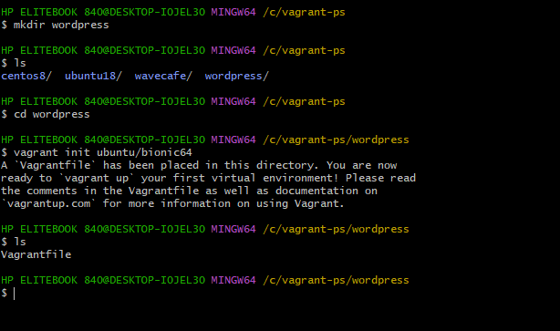
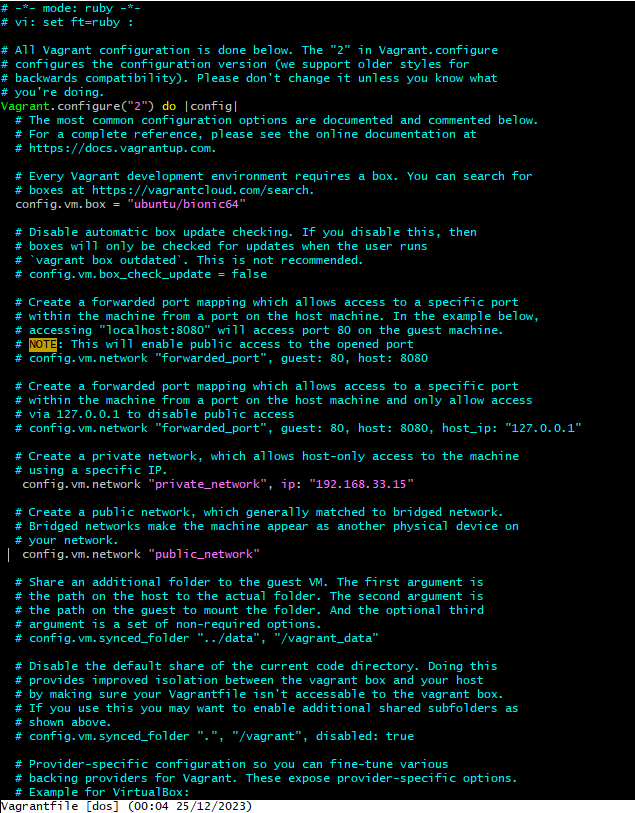
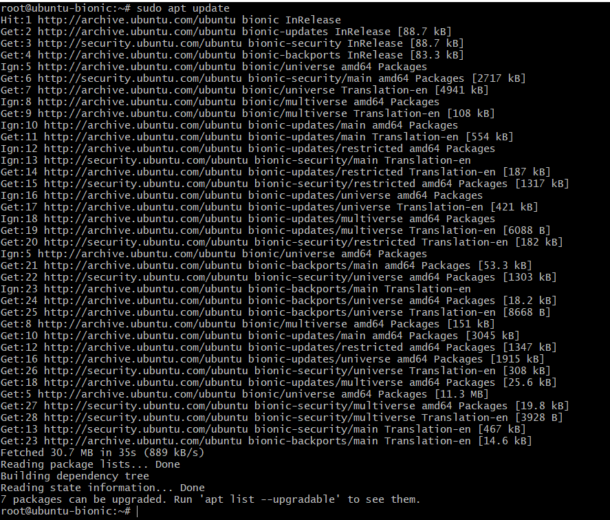
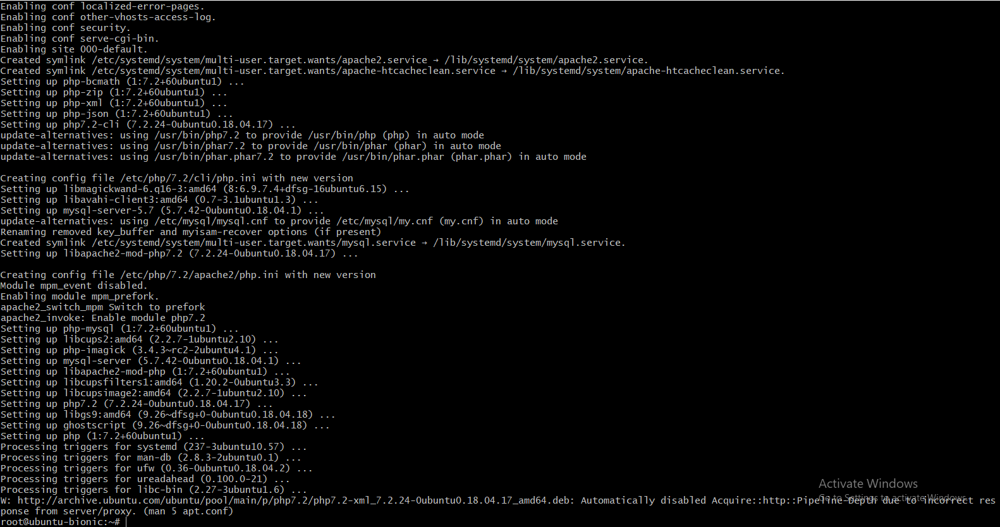
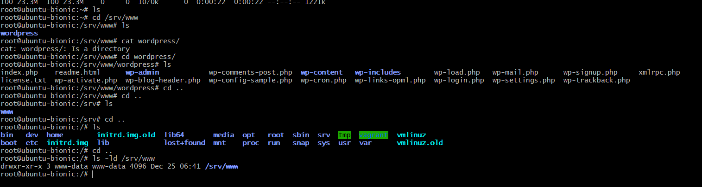
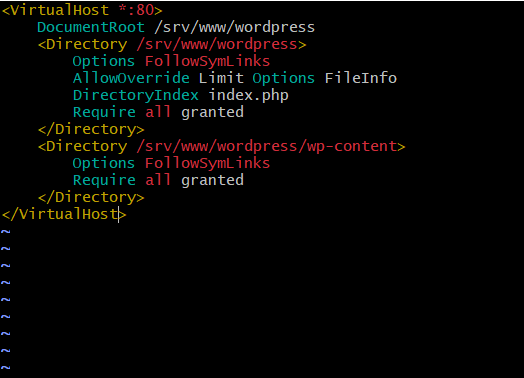
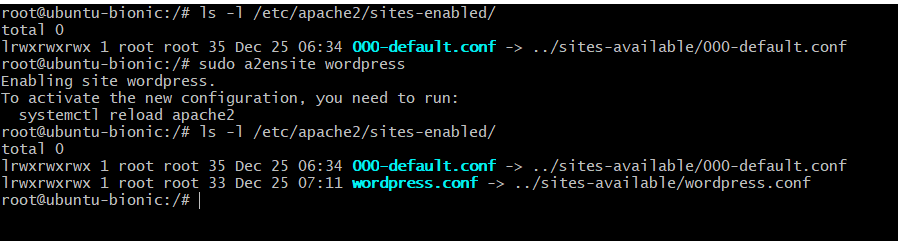
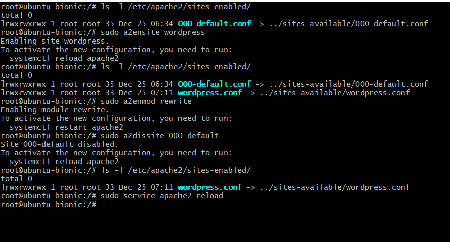
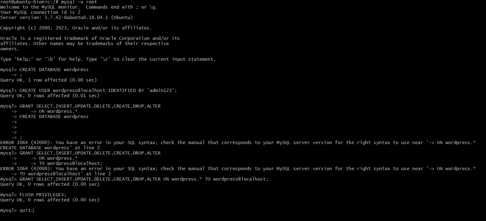
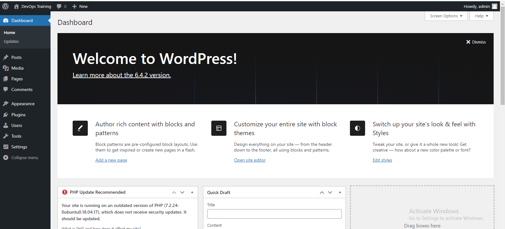

####

- create a directory and name it any name you like

`mkdir -p /c/vagrant-ps/wordpress`

- run vagrant init in the directory
`vagrant init ubuntu/bionic64`

- open the vagrantfile with vi editor and give it a static  and dynamic ip addresses
`vi vagrantfile`

- run vagrant up and vagrant ssh to enter into vm

### Install Dependencies
- To install PHP and Apache, use following command:
`sudo apt update
sudo apt install apache2 \
                 ghostscript \
                 libapache2-mod-php \
                 mysql-server \
                 php \
                 php-bcmath \
                 php-curl \
                 php-imagick \
                 php-intl \
                 php-json \
                 php-mbstring \
                 php-mysql \
                 php-xml \
                 php-zip`

### Install WordPress

- Create the installation directory and download the file from WordPress.org:

- Run the following commands

`sudo mkdir -p /srv/www
sudo chown www-data: /srv/www
curl https://wordpress.org/latest.tar.gz | sudo -u www-data tar zx -C /srv/www`

### Configure Apache for WordPress

- Create Apache site for WordPress. Create /etc/apache2/sites-available/wordpress.conf with following lines:

`<VirtualHost *:80>
    DocumentRoot /srv/www/wordpress
    <Directory /srv/www/wordpress>
        Options FollowSymLinks
        AllowOverride Limit Options FileInfo
        DirectoryIndex index.php
        Require all granted
    </Directory>
    <Directory /srv/www/wordpress/wp-content>
        Options FollowSymLinks
        Require all granted
    </Directory>
</VirtualHost>`

- Enable the site with:

`sudo a2ensite wordpress`

- Enable URL rewriting with:
`sudo a2enmod rewrite`

- Disable the default “It Works” site with:
`sudo a2dissite 000-default`

- Finally, reload apache2 to apply all these changes:

`sudo service apache2 reload`

### Configure database
- To configure WordPress, we need to create MySQL database. Let’s do it!

`$ sudo mysql -u root
Welcome to the MySQL monitor.  Commands end with ; or \g.
Your MySQL connection id is 7
Server version: 5.7.20-0ubuntu0.16.04.1 (Ubuntu)

Copyright (c) 2000, 2017, Oracle and/or its affiliates. All rights reserved.

Oracle is a registered trademark of Oracle Corporation and/or its
affiliates. Other names may be trademarks of their respective
owners.

Type 'help;' or '\h' for help. Type '\c' to clear the current input statement.

mysql> CREATE DATABASE wordpress;
Query OK, 1 row affected (0,00 sec)

mysql> CREATE USER wordpress@localhost IDENTIFIED BY '<your-password>';
Query OK, 1 row affected (0,00 sec)

mysql> GRANT SELECT,INSERT,UPDATE,DELETE,CREATE,DROP,ALTER
    -> ON wordpress.*
    -> TO wordpress@localhost;
Query OK, 1 row affected (0,00 sec)

mysql> FLUSH PRIVILEGES;
Query OK, 1 row affected (0,00 sec)

mysql> quit
Bye
Enable MySQL with sudo service mysql start.`

####  Configure WordPress to connect to the database

- Now, let’s configure WordPress to use this database. First, copy the sample configuration file to wp-config.php:

`sudo -u www-data cp /srv/www/wordpress/wp-config-sample.php /srv/www/wordpress/wp-config.php`

- Next, set the database credentials in the configuration file (do not replace database_name_here or username_here in the commands below. Do replace <your-password> with your database password.):

`sudo -u www-data sed -i 's/database_name_here/wordpress/' /srv/www/wordpress/wp-config.php
sudo -u www-data sed -i 's/username_here/wordpress/' /srv/www/wordpress/wp-config.php
sudo -u www-data sed -i 's/password_here/<your-password>/' /srv/www/wordpress/wp-config.php`

- Finally, in a terminal session open the configuration file in nano:

`sudo -u www-data nano /srv/www/wordpress/wp-config.php`

- Finally, in a terminal session open the configuration file in vi:

`sudo -u www-data nano /srv/www/wordpress/wp-config.php`

- Find the following:

define( 'AUTH_KEY',         'put your unique phrase here' );
define( 'SECURE_AUTH_KEY',  'put your unique phrase here' );
define( 'LOGGED_IN_KEY',    'put your unique phrase here' );
define( 'NONCE_KEY',        'put your unique phrase here' );
define( 'AUTH_SALT',        'put your unique phrase here' );
define( 'SECURE_AUTH_SALT', 'put your unique phrase here' );
define( 'LOGGED_IN_SALT',   'put your unique phrase here' );
define( 'NONCE_SALT',       'put your unique phrase here' );

- Delete those lines.Then replace with the content of [wordpress.org](https://api.wordpress.org/secret-key/1.1/salt/). (This address is a randomiser that returns completely random keys each time it is opened.) This step is important to ensure that your site is not vulnerable to “known secrets” attacks.

